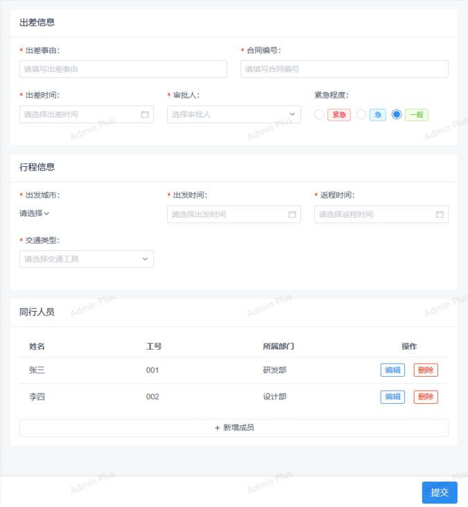

# 不好的编程习惯之列表保存
## 场景
相信大家工作中应该都有遇到过`表单内包含列表数据`的情况。如下图，一个出差申请单里同行人员是可以填写多行的。


首次保存是新增场景，直接insert即可。  
如果允许对表单进行编辑修改，不少程序员的做法是先将数据库里的数据全部删除后，再重新insert。  
例如，首次保存后数据库的数据是

| id | 姓名 |
| ----- | ----- |
| 1 | 张三 |
| 2 | 李四 |

再次编辑时，即使什么都没修改，直接点击保存。由于代码里是先删除再插入，那么id会重新生成。数据库里的数据最终会变成

| id | 姓名 |
| ----- | ----- |
| 3 | 张三 |
| 4 | 李四 |

明白我意思了吗？虽然界面上用户看到的还是张三李四，但是数据库里的id已经变了。
## 问题
小伙伴反问我，虽然id是变了，但是用户看到的数据没变呀，业务含义也没有变呀，业务上又不关注它的id，有什么问题呢？

真的没有问题吗？  
考虑下这个场景。假设这张单有2个人在同时操作，  
小A把`张三`删除了，同时新增了`王五`；  
小B把`李四`删除了，同时新增了`赵六`。  
按`删除再插入`的实现，那么最终的结果受小A和小B的处理顺序影响，后者会把前者的操作给覆盖掉，数据库里的数据最终要么是小A提交的`李四+王五`，要么是小B提交的`张三+赵六`。

但是在业务含义上，在小A和小B的视角里，他们会很困惑。  
小A会想，我明明新增了`王五`，是没有保存成功呢？还是谁把我的数据删了？  
小B也会觉得冤枉，我可从来没有看见过`王五`，更别说删除`王五`了。
## 解决
正确的方式是什么呢？  
**新增、编辑、删除分开处理。**  
我刚提出的时候，小伙伴大叫，那要从数据库里取出来逐个对比，好麻烦呀。  
我提了2个点。  
首先，业务需要的是正确的答案。你一秒就计算出了338483893 * 95858328 = 3 ，确实很快，但结果是错的呀。你写了个简单的方案，却得不到业务想要的结果，简单又有什么意义呢？

其次，谁说没有简单的方案？
## 参考实现
还以小A的操作为例，假设初始数据是

| id | 姓名 |
| ----- | ----- |
| 1 | 张三 |
| 2 | 李四 |

小A删除了`张三`，新增了`王五`。那么在接口传递的时候，客户端向服务器段发送的数据可以是

```json
[
  {id: 1, name: '张三', deleted: true},
  {id: 2, name: '李四', deleted: false},
  {id: null, name: '王五', deleted: false},
]
```
那么服务器在收到请求后，分别处理删除、新增、删除

```java
for(UserDto userDto: users){
    if(Boolean.True.equals(userDto.deleted)){
       // 删除
       delete(userDto);
    }else if(userDto.getId() == null){
       // 新增
       insert(userDto);
    }else{
       // 更新
       update(userDto);
    }
}
```
别纠结我在for循环里操作数据库，也别纠结我直接把dto传给delete、insert等，本文的重点不在这。
## 结果
回到本文开头的例子，小A和小B在各自点击保存后，看到界面上的数据从`张三+李四`变成了`王五+赵六`，但是却不会对他们造成困惑。

比如对小A来说，张三删除成功了，王五新增成功了。  
至于消失的李四和突然出现的赵六，小A一问，是你删掉李四和新增赵六了？  
小B答，是的。

## 花絮
其实现场讨论的时候，还讨论了不少相关的话题。

1. 如果确定涉及多人编辑同一条记录，那就应该增加版本号设计。  
   以本文举的例子来说，在主记录上增加version字段，每次编辑的时候version=version+1同时更新条件加上where version=?  
例如小A和小B同时编辑一个申请单，这时小A和小B加载到的初始version=1。小A保存的时候update table set version=version+1 where version=1。
这样当小B点保存的时候传递的参数还是version=1但数据库里的version已经是2了，小B就会保存失败。  
如果不加版本号，虽然insert和delete不会遇到问题，但是update依然会遇到覆盖的问题。  
2. 在增加version的前提下，也有同事赞成本文的观点。一来 delete all 再 insert all 的做法并不比insert、update、delete分开处理简单省事多少，但是分开处理带来的优势却更多，比如对索引的影响，比如操作日志可以更明确地记录本次操作的变更项等。
