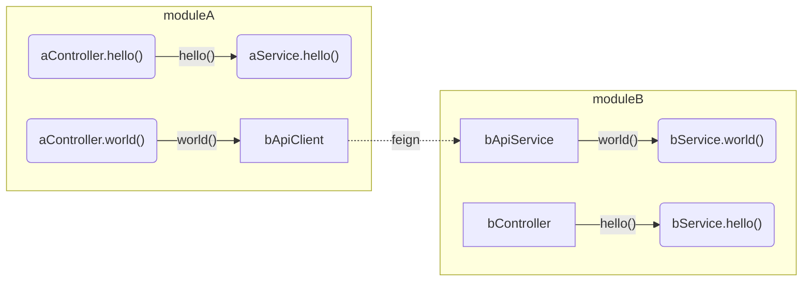

+++
title = "奇怪的ApService分层"
date = "2023-03-19"
Description = ""
Tags = ["Java"]
Categories = ["程序设计"]

+++
## 故事
在JavaWeb开发里，Controller、Service、Dao(Mapper)的分层大家都耳熟能详了。

尽管实际代码里划分得也是一言难尽。

在某项目里看到一个奇怪的ApiService层，它的调用逻辑大概是这样。

微服务架构下，moduleA 和 moduleB 是2个独立的SpringBoot Application。

如果controller调用本模块内的service，直接调用即可。

如下图中的 `aControler.hello() --> aService.hello()` 和 
`bController.hello() --> bService.hello()`

如果是跨模块调用，则需多加一层`ApiService`，如图中的
`aController.world() --> bApiClient.world() --> bApiService.world() --> bService.world()`。
其中`bApiClient`是FeignClient声明。



ApiService里只是调用了Service，具体实现示例如下

```java
@FeignClient
public interface bApiClient extends bApiService{
}

public interface bApiService {
   void world(); 
}

public class bApiServiceImpl implements bApiService{
    private bService bService;
    
    @Override
    void world(){
        bService.world();
    }
}

public interface bService {
    void hello();
    void world();
}
```

## 猜测
一开始我看到ApiService和Service，我以为只是单纯的公开私有隔离。

比如hello方法是单纯提供给本模块内部用的，只需放在Service即可。

但world也需要提供给其他模块用，所以还需要放在ApiService。

我还在想，如果是这样的话，万一某天hello也需要给外部调用了，
那又得在bApiService里对应增加一个hello()，同时又得在bApiServiceImpl里对应增加hello。

与其引入bService，不如直接让bApiService继承bApiService。
接口的实现全在bServiceImpl，这样当hello()也需要暴露出去的时候，
只需要将hello()的声明从bService移动到bApiService即可。
示例如下

```java
public interface bApiService{
    void world();
}

public interface bService extends bApiService {
    void hello();
}

public class bServiceImpl implements bService{
    @Override
    void hello(){}
    
    @Override
    void world(){}
}

@FeignClient
public interface bApiClient extends bApiService{
    
}
```

## 意外
当我和代码作者聊起这个事的时候，没想到代码作者和我说，
> 我当时名字没有起好，虽然叫ApiService，其实我当时设计时想的是，
> ApiService里做的就是参数校验呀这些，就像是 Controller 一样。
> 而且我们这里Feign本身就是用了@RequestMapping这些Controller层的注解暴露出去的嘛。
> 把它理解为Controller层很合理呀

我当时直接是有点呆了，一下子不知道该怎么接话。

专门分一个 ApiService （或者该叫 ApiController） 来做参数校验？

> 对呀，参数校验。前端（用户）传来的参数是不可信任的嘛，这里虽然都是服务器端调用，
> 但是对于b服务来说，a服务也是外部调用嘛，对外部调用都需要考虑参数校验。

## 观点
后来我也在想，微服务间互相调用的这些Feign接口，如果硬要给它划分以下Controller、Service，应该算在哪一层？

有次甚至在网上搜到一个观点，他认为“Feign是Dao层”，不过从搜索页点进去文章页后，该观点被作者用删除线标记了。
可能作者多年后又有了新的想法和认识。

这个点说实话我反复思考也是想不到一个满意的答案。

如果硬要分，我可能倾向于归属是Service层，其次才是Dao层，然而绝对不可能是Controller层。

想着想着，脑子里又冒出一个点。

为什么要给它划分Controller、Service、Dao？这种划分法是单体项目里的流行做法，
既然你要用微服务架构，又偏要拿单体的层次划分来套，这不就是不伦不类吗？

更深层次的观点暂时我也没有。目前还在学习领域驱动设计中。

有时想想也是好笑，一堆做CRUD的码农连Service、DAO的单体都玩不明白，还非要去凑热闹搞微服务。
再一想又是无奈，确实可能是研发要面向简历编程，给自己增加微服务经验。
也不排除是研发也没有话语权，被产品吹牛逼裹挟着做微服务重构，也不可知。

关于Service与Dao的那些事，如[aService直接调用bDao合适吗？](aService直接调用bDao合适吗？.md)，我还有些话想说。

